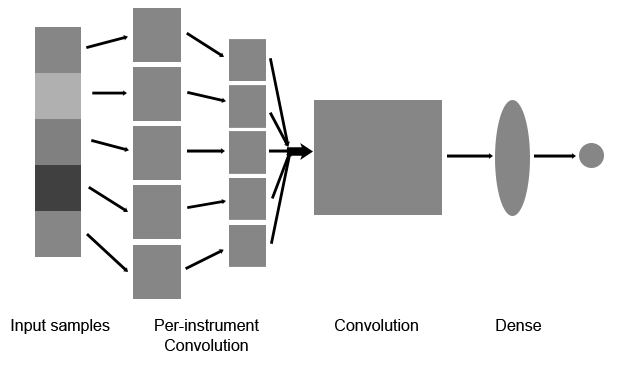
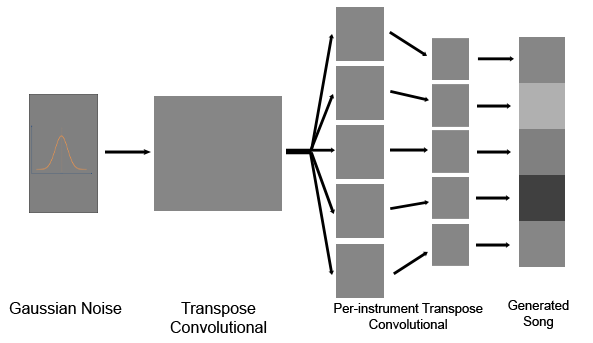
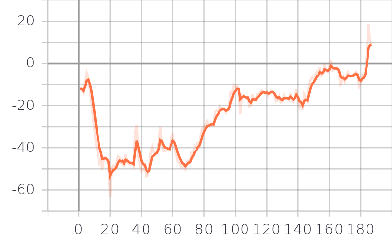

# MusicGAN  
A WGAN implementation that produces short pieces of music.

---

## Main Idea

By looking at a song under a different point of view, it's possible to observe (or hear) many patterns, from scales to rhythms. 
It's well known that GANs have the ability of finding, learning and reproducing patterns on images.
After some preprocessing, the songs are used as input to train a [particular type of GAN](https://arxiv.org/pdf/1701.07875.pdf), i.e. the Wassertein GAN.

## Dataset

As [dataset](http://colinraffel.com/projects/lmd/), a collection of songs in pianoroll format was used. Each song contains 5 instruments, and the notes played by
each instrument at any time. The dataset contains 176581 different songs that were converted to pianorolls (tensors) from MIDI files.

## Preprocessing

Before using it for training, the dataset is modified multiple times. Notes higher or lower than a certain threshold were cut out
to avoid using too much memory without losing too much information, as most notes in the songs are contained in a few octaves.
To generate songs belonging to a certain scale, the notes of a song were transposed so that they all belong to a certain major scale.
All the songs that did not use a major scale were not used for the training.
All the songs were converted to 3-dimensional tensors (of shapes \[Time,Track,Pitch]) suited for being used by a 3D CNN.

## Architecture

As mentioned above, the neural network used is composed of three-dimensional convolutional layers. Note that both the Generator and the Discriminator have a set of CNN branches where each of them, in fact, applies a classic convolution to every matrix formed by each instrument pianoroll.

This is the intuitive scheme of the discriminator.

The input of the Discriminator are the true songs' pieces belonging to the dataset or the generated ones by the other model. In the figure right above, the "Input samples" vector is composed of the different tracks pianorolls (5 in this case), each of which is passed to the track specific 3D CNN, these branches are then concatenated and passed to a series of 3D CNN layers (summarized by the "Convolution" block in the figure), finally a couple of linear layers which outputs a single value, i.e. the realness of the input piece of song.

Whereas this is the intuitive scheme of the generator.

Here instead, the input is a vector of zero-mean and unitary std Gaussian noise vector followed by a series of 3D Transposed Convolutional layers which then are divided into 5 (i.e. number of desired tracks) branches which apply an independent 3D Transposed Convolution to each instrument, in order to finally output a "fake" piece of song.

## Results

After an about 100 epochs long training, these are the results obtained. One thing to note is that the output of the network is not postprocessed aside from choosing the instruments (midi channels) to be used in the reproduction. 

Letting the network listen only to songs from the 80s, this is what came out:

A plot of the generator loss over the 190 epochs:

Generated samples are in the readme folder.

### References

- [WGAN, Arjovsky et al.](https://arxiv.org/pdf/1701.07875.pdf)
- [MuseGAN, Dong et al.](https://arxiv.org/pdf/1709.06298.pdf)
- [C-RNN-GAN, Mogren](http://mogren.one/publications/2016/c-rnn-gan/mogren2016crnngan.pdf)